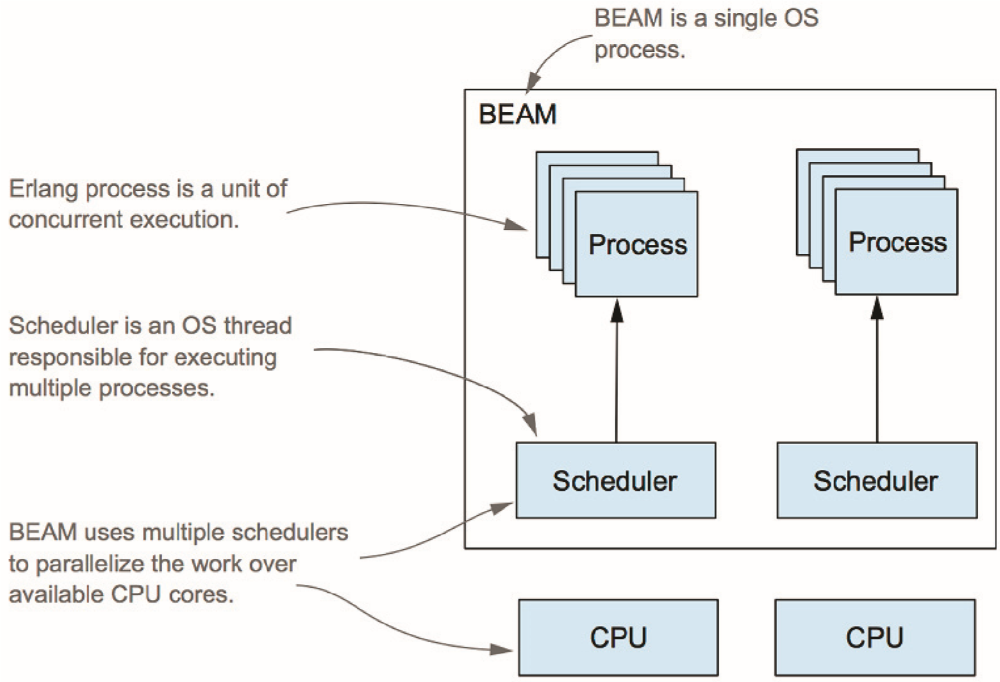

<!-- backgroundColor: #F7F8F8 -->


##
##
##
##
##
##
##
##

### Elixir meets Rust

---

## The Beauty of Elixir

- isolation
- fault tolerant & self-healing
- fearless concurrency
- expressiveness

---

## The Deficiency of Elixir

- performance for computation intensive tasks
- not so good ecosystem
- low-level support

---

## How to solve it？

- ports (mix, inet_drv)
- _NIFs_ (jiffy)
- Write services (e.g. gRPC) with other languages

---
<!-- _backgroundColor: #ffffed -->
## A NIF example

```elixir
defmodule Jaxon.Parsers.NifParser do
  @moduledoc false
  @on_load :load_nifs
  @behaviour Jaxon.Parser

  def load_nifs do
    nif_filename =
      :jaxon
      |> Application.app_dir("priv/decoder")
      |> to_charlist

    :erlang.load_nif(nif_filename, [:start_object, :end_object, :start_array, :end_array, :comma,
      :colon, :string, :decimal, :integer, :boolean, nil, true, false, :error, :yield, :ok, :incomplete, :end
    ])
  end

  @spec parse_nif(String.t()) ::
          [Jaxon.Event.t()] | {:yield, [Jaxon.Event.t()], String.t()} | no_return()
  defp parse_nif(_) do
    :erlang.nif_error("Jaxon.Parsers.NifParser.parse_nif/1: NIF not compiled")
  end
```

###### [nif doc](http://erlang.org/doc/tutorial/nif.html) | [nif_parser.ex](https://github.com/boudra/jaxon/blob/master/lib/jaxon/parsers/nif_parser.ex) | [decoder_nif.c](https://github.com/boudra/jaxon/blob/master/c_src/decoder_nif.c)


---

## NIFs：pros and cons

- pros:
  - the functionality is implemented elsewhere, e.g. C/C++/rust
  - fastest speed (compared with ports, services)
  - (relatively) easy to write and maintain
  - no context switch as it runs in the same OS process space
- cons:
  - existing c/c++ solution is insecure (can potentially crash VM or leak memory)

---

## Rust

- same speed as C/C++
- memory safety and concurrency safety
- zero-cost abstraction
- very powerful and expressive lang (you would love as a elixirer)
- powerful type system
- much better ecosystem than elixir, esp. high performance data structure/algo

---

### Rustler：bridging elixir/rust

- safety:
  - your __safe rust__ won't crash VM
  - memory and concurrency safety
- interop: data could be passed easily
  - Rust struct <-> elixir term
- efficiency: whenever necessary, data could be passed by ref
  - ResourceArc
  - the best part: rust data is destroyed automatically when elixir ref is GC'ed

---

<!-- _backgroundColor: #222831 -->
<!-- _color: #fff -->

## How to use rustler？

- First of all, you need rust toolchain: https://rustup.rs/
- demo 1: much faster markdown -> html compiler
- demo 2: make elixir support highly efficient ordered map (BTreeMap)

---

### 1. Introduce rustler into your mix project
<!-- _backgroundColor: #ffffed -->

```elixir
def project do
[
    ...
    compilers: [:rustler] ++ Mix.compilers,
    rustler_crates: [rmark: [
        path: "native/rmark",
        mode: rustc_mode(Mix.env)
    ]],
    ...
    defp rustc_mode(:prod), do: :release
    defp rustc_mode(_), do: :debug
]

defp deps do
[
    ...
    {:rustler, "~> 0.21.0"},
    ...
]
```
---

### 2. create rust project
<!-- _backgroundColor: #ffffed -->

```bash
➜ mix rustler.new
This is the name of the Elixir module the NIF module will be registered to.
Module name > Rmark
This is the name used for the generated Rust crate. The default is most likely fine.
Library name (rmark) >
* creating native/rmark/.cargo/config
* creating native/rmark/README.md
* creating native/rmark/Cargo.toml
* creating native/rmark/src/lib.rs
Ready to go! See /Users/tchen/projects/mycode/elixir/elixir-meet-rust/rmark/native/rmark/README.md for further instructions.

```

---
<!-- _backgroundColor: #ffffed -->

### 3. add rust dependency

```toml
# native/cargo.toml
[dependencies]
...
rustler = "0.21.0"
...
```

---
<!-- _backgroundColor: #ffffed -->

### 4. implement in rust!

```rust
// native/src/lib.rs
use rustler::{Encoder, Env, Error, Term};
use comrak::{markdown_to_html, ComrakOptions};

mod atoms {
    rustler::rustler_atoms! {
        atom ok;
        //atom error;
        //atom __true__ = "true";
        //atom __false__ = "false";
    }
}

rustler::rustler_export_nifs! {
    "Elixir.Rmark", [
        ("to_html", 1, to_html)
    ],
    None
}

fn to_html<'a>(env: Env<'a>, args: &[Term<'a>]) -> Result<Term<'a>, Error> {
    let md: String = args[0].decode()?;
    Ok((atoms::ok(), markdown_to_html(&md, &ComrakOptions::default())).encode(env))
}
```

---
<!-- _backgroundColor: #ffffed -->

### 5. add elixir bindings

```elixir
# lib/rmark.ex
defmodule Rmark do
  @moduledoc """
  Documentation for `Rmark`.
  """

  # NOTE: @on_load is automatically generated by this `use`
  use Rustler, otp_app: :rmark, crate: :rmark

  def to_html(_md), do: :erlang.nif_error(:nif_not_loaded)
end
```

---
<!-- _backgroundColor: #ffffed -->

### 6. try it out

```elixir
➜ iex -S mix
Erlang/OTP 22 [erts-10.7.1] [source] [64-bit] [smp:16:16] [ds:16:16:10] [async-threads:1] [hipe] [dtrace]

Compiling NIF crate :rmark (native/rmark)...
    Finished dev [unoptimized + debuginfo] target(s) in 0.16s
Interactive Elixir (1.10.2) - press Ctrl+C to exit (type h() ENTER for help)
to_html_dirty/1    to_html_spawn/1
iex(1)> Rmark.
MixProject         to_html/1          to_html2/1         to_html3/1
to_html_dirty/1    to_html_spawn/1
iex(1)> Rmark.to_html("# hello world!")
{:ok, "<h1>hello world!</h1>\n"}
```

---


### What's the problem of this code？

---



#### If input is big, it would block the scheduler

- Scheduling mode inside VM: cooperative multitasking，2000 reds/round
  - for your erlang/elixir code, preemptive multitasking
- NIF shall be cooperative, avoid using too much time of scheduler

---

## Solution

- chunk the input data（WTF）
- ~~copporative with scheduler in NIF~~ (rustler not yet supported)
- use rust thread (asynchronous message back the result)
- Dirty Scheduler (> OTP 20, easiest and painless)

---
<!-- _backgroundColor: #ffffed -->

## Rust thread

```rust
// rust
fn to_html_spawn<'a>(env: Env<'a>, args: &[Term<'a>]) -> Result<Term<'a>, Error> {
    let md: String = args[0].decode()?;
    use rustler::thread;
    thread::spawn::<thread::ThreadSpawner, _>(env, move |env| {
        let result = markdown_to_html(&md, &ComrakOptions::default());
        (atoms::ok(), result).encode(env)
    });
    Ok(atoms::ok().encode(env))
}

// elixir
def to_html2(md) do
  :ok = to_html_spawn(md)
  receive do
    {:ok, result} -> {:ok, result}
    {:error, error} -> {:error, error}
  after
    5000 ->
      {:error, :timeout}
  end
end
```

---
<!-- _backgroundColor: #ffffed -->
## Dirty Scheduler

```rust
use rustler::schedule::SchedulerFlags::DirtyCpu;

rustler::rustler_export_nifs! {
    "Elixir.Rmark",
    [
        ("to_html", 1, to_html),
        ("to_html_spawn", 1, to_html_spawn),
        ("to_html_dirty", 1, to_html, DirtyCpu),
    ],
    None
}
```

---
<!-- _color: white -->


## Problem solved

###### NIF not block scheduler any more!

---

<!-- _backgroundColor: #ffffed -->

## Benchmark

```bash
➜ mix run benchmark/markdown.exs
Compiling NIF crate :rmark (native/rmark)...
    Finished dev [unoptimized + debuginfo] target(s) in 2.05s
Operating System: macOS
CPU Information: Intel(R) Core(TM) i9-9980HK CPU @ 2.40GHz
Number of Available Cores: 16
Available memory: 64 GB
Elixir 1.10.2
Erlang 22.3.2

...

Name                  ips        average  deviation         median         99th %
rmark              173.29        5.77 ms     ±6.42%        5.63 ms        7.59 ms
rmark_spawn        169.61        5.90 ms     ±7.71%        5.72 ms        8.16 ms
rmark_dirty        168.86        5.92 ms     ±8.82%        5.68 ms        7.57 ms
earmark             78.80       12.69 ms     ±8.57%       12.55 ms       16.10 ms

Comparison:
rmark              173.29
rmark_spawn        169.61 - 1.02x slower +0.125 ms
rmark_dirty        168.86 - 1.03x slower +0.151 ms
earmark             78.80 - 2.20x slower +6.92 ms
```

---


##### I fought with rust compiler with rage to get things done, _yet just get 1x improvement?_

---
<!-- _backgroundColor: #ffffed -->
## Benchmark with prod

```bash
➜ MIX_ENV=prod mix run benchmark/markdown.exs
Compiling NIF crate :rmark (native/rmark)...
    Finished release [optimized] target(s) in 0.03s
Operating System: macOS
CPU Information: Intel(R) Core(TM) i9-9980HK CPU @ 2.40GHz
Number of Available Cores: 16
Available memory: 64 GB
Elixir 1.10.2
Erlang 22.3.2

...

Name                  ips        average  deviation         median         99th %
rmark              2.39 K      419.01 μs    ±11.72%         407 μs      662.14 μs
rmark_dirty        2.10 K      476.58 μs    ±13.78%         464 μs         787 μs
rmark_spawn        1.95 K      514.06 μs    ±14.77%         496 μs      883.74 μs
earmark          0.0806 K    12408.99 μs     ±7.81%       12262 μs    15110.40 μs

Comparison:
rmark              2.39 K
rmark_dirty        2.10 K - 1.14x slower +57.57 μs
rmark_spawn        1.95 K - 1.23x slower +95.05 μs
earmark          0.0806 K - 29.61x slower +11989.98 μs
```

---

## The next frontier

- ResourceArc
- More elegant rustler 0.22.0-rc.0
- Use Env / Decoder


---

## rustler 0.22：more rusty

---
<!-- _backgroundColor: #ffffed -->

## Old code: native/src/lib.rs

```rust
use rustler::{Encoder, Env, Error, Term};
use comrak::{markdown_to_html, ComrakOptions};

mod atoms {
    rustler::rustler_atoms! {
        atom ok;
        //atom error;
        //atom __true__ = "true";
        //atom __false__ = "false";
    }
}

rustler::rustler_export_nifs! {
    "Elixir.Rmark", [
        ("to_html", 1, to_html)
    ],
    None
}

fn to_html<'a>(env: Env<'a>, args: &[Term<'a>]) -> Result<Term<'a>, Error> {
    let md: String = args[0].decode()?;
    Ok((atoms::ok(), markdown_to_html(&md, &ComrakOptions::default())).encode(env))
}
```

---

<!-- _backgroundColor: #ffffed -->

## New code: native/src/lib.rs

```rust
use comrak::{markdown_to_html, ComrakOptions};

#[rustler::nif]
fn to_html(md: String) -> String {
    markdown_to_html(&md, &ComrakOptions::default())
}

rustler::init!("Elixir.Rmark", [to_html]);
```

---

<!-- _backgroundColor: #222831 -->
<!-- _color: #fff -->

## Live coding

Let elixir support [BTreeMap](https://doc.rust-lang.org/std/collections/struct.BTreeMap.html)

---
<!-- _backgroundColor: #ffffed -->

```elixir
iex(1)> m = Rbtree.new()
#Reference<0.3262434626.2540568582.136961>
iex(2)> Rbtree.get(m, "hello")
{:error, :not_found}
iex(3)> Rbtree.put(m, "hello", "world")
:ok
iex(4)> Rbtree.put(m, "goodbye", "world")
:ok
iex(5)> Rbtree.put(m, "greeting", "world")
:ok
iex(6)> Rbtree.get(m, "hello")
{:ok, "world"}
iex(7)> Rbtree.put(m, "hello", "world1")
:ok
iex(8)> Rbtree.get(m, "hello")
{:ok, "world1"}
iex(9)> Rbtree.to_list(m)
{:ok, [{"goodbye", "world"}, {"greeting", "world"}, {"hello", "world1"}]}
iex(10)> Rbtree.delete(m, "greeting")
:ok
iex(11)> Rbtree.to_list(m)
{:ok, [{"goodbye", "world"}, {"hello", "world1"}]}
iex(12)> Rbtree.crash_me_please(m)
** (ErlangError) Erlang error: :nif_panicked
    (rbtree 0.1.0) Rbtree.crash_me_please(#Reference<0.3262434626.2540568582.136961>)
iex(12)> Rbtree.to_list(m)
{:ok, [{"goodbye", "world"}, {"hello", "world1"}]}
iex(6)> ref = make_ref()
#Reference<0.1411875086.4143185933.220281>
iex(8)> Rbtree.get(ref, "hello")
** (ArgumentError) argument error
    (rbtree 0.1.0) Rbtree.get(#Reference<0.1411875086.4143185933.220281>, "hello")
```

---

## What else did we learn?

- ResourceArc: Share data (state) between rust and elilxir
- Env / Encoder: how to serialize your own data structure
- rust(safe) code crash won't crash VM, indeed!

---
<!-- _backgroundColor: white -->


## I'm not rust yet，how should I do?

---

## Homework

Let elixir support [Roaring Bitmap](https://github.com/Nemo157/roaring-rs)

---

## Reference

- [learning rust](https://www.rust-lang.org/learn)
- [rustler](https://github.com/rusterlium/rustler)
  - [erlang nif sys](https://github.com/rusterlium/erlang_nif-sys)
- [xqlite](https://github.com/dimitarvp/xqlite)

---
<!-- _backgroundColor: black -->
<!-- _color: lightgrey -->

# May the _Rust_ be with you!
