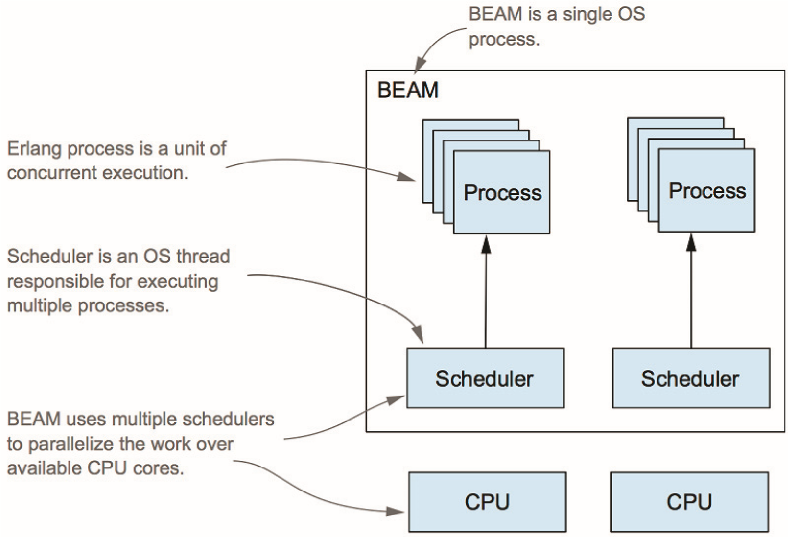

<!-- backgroundColor: #F7F8F8 -->


##
##
##
##
##
##
##
##

### Elixir 遇见 Rust

---


## 关于我

- 女儿奴
- elixir, rust, flutter, blockchain 爱好者
- 懒散的码字农：
  - [《途客圈创业记》](https://book.douban.com/subject/26739566/)
  - 公众号：程序人生/天叔奇谈
  - 知乎：[迷思](https://zhuanlan.zhihu.com/prattle)
- 不成功的 up 主
  - [喜欢历史的程序君](https://space.bilibili.com/39222989)
- 马拉松入门选手
  - 最好成绩：4h32m (2019 portland)

---

## Elixir 的美妙之处

- 隔离（isolation）
- 容错和自我恢复（fault tolerant & self-healing）
- 安全并发（fearless concurrency）
- 语言表达力强（expressiveness）

---

## Elixir 的不足

- 性能（performance）
- 生态（ecosystem）
- 底层开发（low-level support）

---

## 如何解决？

- ports (mix, inet_drv)
- _NIFs_ (jiffy)
- 用其他语言撰写服务（如 gRPC）

---
<!-- _backgroundColor: #ffffed -->
## NIF 例子

```elixir
defmodule Jaxon.Parsers.NifParser do
  @moduledoc false
  @on_load :load_nifs
  @behaviour Jaxon.Parser

  def load_nifs do
    nif_filename =
      :jaxon
      |> Application.app_dir("priv/decoder")
      |> to_charlist

    :erlang.load_nif(nif_filename, [:start_object, :end_object, :start_array, :end_array, :comma,
      :colon, :string, :decimal, :integer, :boolean, nil, true, false, :error, :yield, :ok, :incomplete, :end
    ])
  end

  @spec parse_nif(String.t()) ::
          [Jaxon.Event.t()] | {:yield, [Jaxon.Event.t()], String.t()} | no_return()
  defp parse_nif(_) do
    :erlang.nif_error("Jaxon.Parsers.NifParser.parse_nif/1: NIF not compiled")
  end
```

###### [nif 文档](http://erlang.org/doc/tutorial/nif.html) | [nif_parser.ex](https://github.com/boudra/jaxon/blob/master/lib/jaxon/parsers/nif_parser.ex) | [decoder_nif.c](https://github.com/boudra/jaxon/blob/master/c_src/decoder_nif.c)


---

## NIFs：优势和不足

- 优势：
  - 功能已经在别处实现，比如 C/C++/rust
  - 运行速度最快
  - （相对）容易撰写和维护
  - 和 VM 运行在同一个进程空间，没有上下文切换开销
- 不足：
  - 现有的 C/C++ 解决方案不够安全（可以 crash VM 或者导致内存泄漏）

---

## Rust

- 执行效率媲美 C/C++
- 内存安全和并发安全
- 零成本抽象
- 语言表达力很强
- 强大的让人爱不释手的类型系统
- 生态比 elixir 大很多，且有很多高性能数据结构和算法的实现

---

### Rustler：为 elixir/rust 建起一座桥

- 安全：
  - 你撰写的 safe rust 不会 crash VM
  - 内存安全和并发安全
- 互操作：数据在两种语言之间可以很方便地传递
  - Rust struct <-> elixir term
- 高效：数据可以按引用传递；当不再引用时自动销毁
  - ResourceArc

---

<!-- _backgroundColor: #222831 -->
<!-- _color: #fff -->

## 如何使用 rustler？

- 你需要安装 rust 工具链：https://rustup.rs/
- demo 1: 更快的 markdown -> html compiler
- demo 2: 让 elixir 支持高效的有序字典（BTreeMap）

---

### 1. 在项目中引入 rustler
<!-- _backgroundColor: #ffffed -->

```elixir
def project do
[
    ...
    compilers: [:rustler] ++ Mix.compilers,
    rustler_crates: [rmark: [
        path: "native/rmark",
        mode: rustc_mode(Mix.env)
    ]],
    ...
    defp rustc_mode(:prod), do: :release
    defp rustc_mode(_), do: :debug
]

defp deps do
[
    ...
    {:rustler, "~> 0.21.0"},
    ...
]
```
---

### 2. 创建 rust 项目
<!-- _backgroundColor: #ffffed -->

```bash
➜ mix rustler.new
This is the name of the Elixir module the NIF module will be registered to.
Module name > Rmark
This is the name used for the generated Rust crate. The default is most likely fine.
Library name (rmark) >
* creating native/rmark/.cargo/config
* creating native/rmark/README.md
* creating native/rmark/Cargo.toml
* creating native/rmark/src/lib.rs
Ready to go! See /Users/tchen/projects/mycode/elixir/elixir-meet-rust/rmark/native/rmark/README.md for further instructions.

```

---
<!-- _backgroundColor: #ffffed -->

### 3. 添加 rust 的依赖

```toml
# native/cargo.toml
[dependencies]
...
rustler = "0.21.0"
...
```

---
<!-- _backgroundColor: #ffffed -->

### 4. 撰写 rust 实现

```rust
// native/src/lib.rs
use rustler::{Encoder, Env, Error, Term};
use comrak::{markdown_to_html, ComrakOptions};

mod atoms {
    rustler::rustler_atoms! {
        atom ok;
        //atom error;
        //atom __true__ = "true";
        //atom __false__ = "false";
    }
}

rustler::rustler_export_nifs! {
    "Elixir.Rmark", [
        ("to_html", 1, to_html)
    ],
    None
}

fn to_html<'a>(env: Env<'a>, args: &[Term<'a>]) -> Result<Term<'a>, Error> {
    let md: String = args[0].decode()?;
    Ok((atoms::ok(), markdown_to_html(&md, &ComrakOptions::default())).encode(env))
}
```

---
<!-- _backgroundColor: #ffffed -->

### 5. 添加 elixir 映射

```elixir
# lib/rmark.ex
defmodule Rmark do
  @moduledoc """
  Documentation for `Rmark`.
  """

  # NOTE: @on_load is automatically generated by this `use`
  use Rustler, otp_app: :rmark, crate: :rmark

  def to_html(_md), do: :erlang.nif_error(:nif_not_loaded)
end
```

---
<!-- _backgroundColor: #ffffed -->

### 6. 尝试一下

```elixir
➜ iex -S mix
Erlang/OTP 22 [erts-10.7.1] [source] [64-bit] [smp:16:16] [ds:16:16:10] [async-threads:1] [hipe] [dtrace]

Compiling NIF crate :rmark (native/rmark)...
    Finished dev [unoptimized + debuginfo] target(s) in 0.16s
Interactive Elixir (1.10.2) - press Ctrl+C to exit (type h() ENTER for help)
to_html_dirty/1    to_html_spawn/1
iex(1)> Rmark.
MixProject         to_html/1          to_html2/1         to_html3/1
to_html_dirty/1    to_html_spawn/1
iex(1)> Rmark.to_html("# hello world!")
{:ok, "<h1>hello world!</h1>\n"}
```

---


### 这代码有问题么？

---



#### 输入如果非常大，会阻塞 scheduler

- erlang 内部调度模型：cooperative multitasking，2000 reds/round
- NIF 应该避免过度占用 scheduler

---

## 解决方案

- 对输入数据进行切片（WTF）
- ~~在 NIF 中允许被调度~~（rustler 尚无完整支持）
- 使用 rust thread（异步处理）
- Dirty Scheduler（> OTP 20，无痛方案）

---
<!-- _backgroundColor: #ffffed -->

## Rust thread

```rust
// rust
fn to_html_spawn<'a>(env: Env<'a>, args: &[Term<'a>]) -> Result<Term<'a>, Error> {
    let md: String = args[0].decode()?;
    use rustler::thread;
    thread::spawn::<thread::ThreadSpawner, _>(env, move |env| {
        let result = markdown_to_html(&md, &ComrakOptions::default());
        (atoms::ok(), result).encode(env)
    });
    Ok(atoms::ok().encode(env))
}

// elixir
def to_html2(md) do
  :ok = to_html_spawn(md)
  receive do
    {:ok, result} -> {:ok, result}
    {:error, error} -> {:error, error}
  after
    5000 ->
      {:error, :timeout}
  end
end
```

---
<!-- _backgroundColor: #ffffed -->
## Dirty Scheduler

```rust
use rustler::schedule::SchedulerFlags::DirtyCpu;

rustler::rustler_export_nifs! {
    "Elixir.Rmark",
    [
        ("to_html", 1, to_html),
        ("to_html_spawn", 1, to_html_spawn),
        ("to_html_dirty", 1, to_html, DirtyCpu),
    ],
    None
}
```

---
<!-- _color: white -->


## Problem solved!

###### NIF 不再阻塞 scheduler

---

<!-- _backgroundColor: #ffffed -->

## Benchmark

```bash
➜ mix run benchmark/markdown.exs
Compiling NIF crate :rmark (native/rmark)...
    Finished dev [unoptimized + debuginfo] target(s) in 2.05s
Operating System: macOS
CPU Information: Intel(R) Core(TM) i9-9980HK CPU @ 2.40GHz
Number of Available Cores: 16
Available memory: 64 GB
Elixir 1.10.2
Erlang 22.3.2

...

Name                  ips        average  deviation         median         99th %
rmark              173.29        5.77 ms     ±6.42%        5.63 ms        7.59 ms
rmark_spawn        169.61        5.90 ms     ±7.71%        5.72 ms        8.16 ms
rmark_dirty        168.86        5.92 ms     ±8.82%        5.68 ms        7.57 ms
earmark             78.80       12.69 ms     ±8.57%       12.55 ms       16.10 ms

Comparison:
rmark              173.29
rmark_spawn        169.61 - 1.02x slower +0.125 ms
rmark_dirty        168.86 - 1.03x slower +0.151 ms
earmark             78.80 - 2.20x slower +6.92 ms
```

---


### 我辛辛苦苦装逼写 rust，你就给我快一倍？？？

---
<!-- _backgroundColor: #ffffed -->
## Benchmark with prod

```bash
➜ MIX_ENV=prod mix run benchmark/markdown.exs
Compiling NIF crate :rmark (native/rmark)...
    Finished release [optimized] target(s) in 0.03s
Operating System: macOS
CPU Information: Intel(R) Core(TM) i9-9980HK CPU @ 2.40GHz
Number of Available Cores: 16
Available memory: 64 GB
Elixir 1.10.2
Erlang 22.3.2

...

Name                  ips        average  deviation         median         99th %
rmark              2.39 K      419.01 μs    ±11.72%         407 μs      662.14 μs
rmark_dirty        2.10 K      476.58 μs    ±13.78%         464 μs         787 μs
rmark_spawn        1.95 K      514.06 μs    ±14.77%         496 μs      883.74 μs
earmark          0.0806 K    12408.99 μs     ±7.81%       12262 μs    15110.40 μs

Comparison:
rmark              2.39 K
rmark_dirty        2.10 K - 1.14x slower +57.57 μs
rmark_spawn        1.95 K - 1.23x slower +95.05 μs
earmark          0.0806 K - 29.61x slower +11989.98 μs
```

---

## 进阶

- ResourceArc
- 更优雅的 rustler 0.22.0-rc.0
- 使用 Env / Decoder


---

## rustler 0.22：更加 rusty

---
<!-- _backgroundColor: #ffffed -->

## 旧代码：native/src/lib.rs

```rust
use rustler::{Encoder, Env, Error, Term};
use comrak::{markdown_to_html, ComrakOptions};

mod atoms {
    rustler::rustler_atoms! {
        atom ok;
        //atom error;
        //atom __true__ = "true";
        //atom __false__ = "false";
    }
}

rustler::rustler_export_nifs! {
    "Elixir.Rmark", [
        ("to_html", 1, to_html)
    ],
    None
}

fn to_html<'a>(env: Env<'a>, args: &[Term<'a>]) -> Result<Term<'a>, Error> {
    let md: String = args[0].decode()?;
    Ok((atoms::ok(), markdown_to_html(&md, &ComrakOptions::default())).encode(env))
}
```

---

<!-- _backgroundColor: #ffffed -->

## 新代码：native/src/lib.rs

```rust
use comrak::{markdown_to_html, ComrakOptions};

#[rustler::nif]
fn to_html(md: String) -> String {
    markdown_to_html(&md, &ComrakOptions::default())
}

rustler::init!("Elixir.Rmark", [to_html]);
```

---

<!-- _backgroundColor: #222831 -->
<!-- _color: #fff -->

## Live ~~coding~~ Demo

让 elixir 支持 [BTreeMap](https://doc.rust-lang.org/std/collections/struct.BTreeMap.html)

---
<!-- _backgroundColor: #ffffed -->

```elixir
iex(1)> m = Rbtree.new()
#Reference<0.3262434626.2540568582.136961>
iex(2)> Rbtree.get(m, "hello")
{:error, :not_found}
iex(3)> Rbtree.put(m, "hello", "world")
:ok
iex(4)> Rbtree.put(m, "goodbye", "world")
:ok
iex(5)> Rbtree.put(m, "greeting", "world")
:ok
iex(6)> Rbtree.get(m, "hello")
{:ok, "world"}
iex(7)> Rbtree.put(m, "hello", "world1")
:ok
iex(8)> Rbtree.get(m, "hello")
{:ok, "world1"}
iex(9)> Rbtree.to_list(m)
{:ok, [{"goodbye", "world"}, {"greeting", "world"}, {"hello", "world1"}]}
iex(10)> Rbtree.delete(m, "greeting")
:ok
iex(11)> Rbtree.to_list(m)
{:ok, [{"goodbye", "world"}, {"hello", "world1"}]}
iex(12)> Rbtree.crash_me_please(m)
** (ErlangError) Erlang error: :nif_panicked
    (rbtree 0.1.0) Rbtree.crash_me_please(#Reference<0.3262434626.2540568582.136961>)
iex(12)> Rbtree.to_list(m)
{:ok, [{"goodbye", "world"}, {"hello", "world1"}]}
iex(6)> ref = make_ref()
#Reference<0.1411875086.4143185933.220281>
iex(8)> Rbtree.get(ref, "hello")
** (ArgumentError) argument error
    (rbtree 0.1.0) Rbtree.get(#Reference<0.1411875086.4143185933.220281>, "hello")
```

---

## 我们又学到了什么？

- ResourceArc：如何在 rust 和 elixir 间共享数据
- Env / Encoder：如何序列化你自己的数据结构
- rust 代码 crash 真的不会 crash VM

---
<!-- _backgroundColor: white -->


## 我不会 rust，怎么办？

---

## Homework

让 elixir 支持 [Roaring Bitmap](https://github.com/Nemo157/roaring-rs)

---

## Reference

- [learning rust](https://www.rust-lang.org/learn)
- [rustler](https://github.com/rusterlium/rustler)
  - [erlang nif sys](https://github.com/rusterlium/erlang_nif-sys)
- [xqlite](https://github.com/dimitarvp/xqlite)

---
<!-- _color: white -->


# May the __Rust__ be with you!

###### 本次讲座的 slides 及代码可在 [tyrchen/elixir-meet-rust](https://github.com/tyrchen/elixir-meet-rust) 上找到

###### 补充：Q&A 见后页

---

> ###### 1. 在 erlang vm 里面有办法 rust async 函数吗？

###### 一般来说，async 跟 IO 有关，而 rustler 要解决的是计算密集型的问题。但既然提到这个问题，我做了一个小实验，代码见 [rhttp](./rhttp)。如你所见，nif 函数目前不能直接是 async（没有实现 future 接口），以后不好说（deno 支持 rust future <-> js promise 间的互换，elixir 没有类似 future/promise 的数据结构，但也许可以用 GenServer 或者 Task 模拟）。所以如果一个库是 async 实现，我们需要用 `rt.block_on` 强行等待将其执行完毕，当然这样就完全把异步当做同步来看待了。注意在跟 IO 相关的 NIF 里，推荐使用 DirtyIo，这样不阻塞 elixir process 的 IO。

```rust
#[rustler::nif(schedule = "DirtyIo")]
fn get(url: String) -> String {
    let mut rt = Runtime::new().unwrap();
    let result = rt.block_on(async { http_get(&url).await });
    result
}
```

---

> ###### 2. Erlang 用的是 Preemptive Scheduling 吧只是 NIF function 需要 be cooperative?

###### erlang 的 VM 实现（C 代码）是 cooperative scheduling，展现给用户程序（erlang / elixir 代码）的是 preemptive scheduling。因为 NIF 运行在 VM 态，所以需要 cooperative，来确保其不会阻塞调度器。

---

> ###### 3. 返回的数据如果是 rust 数据的一个引用，怎么解决 lifetime 的问题？ 会不会出现 rust 把数据 drop 掉了， elixir 还想要使用这个数据？或者 rust 如何决定什么时候 drop 一个数据？

###### ResourceArc 是对 rust Arc 的一个封装，目的就是解决 elixir 代码持有的引用计数的问题。rust 侧的内存是否回收，取决于引用计数是否为零。rust 的整个借用机制（以及之上的封装）保证了在没有 GC 情况下的内存安全。所以只要代码能够编译通过，就不会出现野指针的问题。而 rustler 巧妙地使用了 Arc，让 elixir 的 reference（`make_ref()`）持有 rust 的 Arc，这样，无论多线程环境下这个 ref 怎么折腾，比如 process A -> process B -> process C，当这个 ref 在 elixir 侧 GC 时（所有使用它的 process 都退出），rust 侧 Arc 引用计数归零导致其内存被回收，感兴趣的同学可以具体看 ResourceArc 的 Drop trait 的实现。

---

> ###### 4. Elixir是否可以和JVM生态联动？

###### 可以。通过 ports。不建议使用 NIF，因为 NIF 需要把编译出来的动态链接库（*.so）在对应模块加载时，加载到当前 elixir 进程的上下文中。即便可以把 JVM 运行时编译成动态链接库，加载一个几百兆的库，使用其中很小一个功能，意义也不是很大。

---

> ###### 5. Elixir 通过 NIF（Rustler）调用的 overhead 是怎么样的，特别是 NIF 调用时的数据encode/decode 大概有多大开销。比如 Elixir 传个大的 binary 给 rust，rust 返回一个大的 map 回来。

###### 因为在同一个进程空间里，开销主要在两个语言数据结构见的 encoding/decoding。这个相对来说非常小，就是单纯的内存操作（拷贝 + 转换），其执行效率的数量级和 elixir 中传递消息应该差不多。对于潜在的对大量数据的密集操作，比如我 demo 2 中的 BtreeMap，来回传值没有意义，应该通过引用来访问。

---
> ###### 6. 这个白板工具是啥？这个Keynote 工具又是啥？

###### 白板是 ipad 通过数据线连接到 mac，然后再通过 quicktime 显示到 mac 桌面，这样可以使用 pencil 方便绘图。ipad 里面绘图的工具是 Notability。Keynote 工具是 [marp](https://marp.app/)。

---

> ###### 7. 我对 elixir 不熟，为什么 immutable 的语言还会需要 makeref？这个得到的 ref 是可变的？

###### ref 是一个唯一引用，可以通过 [make_ref](http://erlang.org/documentation/doc-5.7.4/erts-5.7.4/doc/html/erlang.html#make_ref-0) 生成，它跟是否 mutable 无关。在 Rustler 里，ref 被用作标识 rust 侧共享给 elixir 侧的资源。在 erlang/elixir 中，ref 一般被用作某个数据的唯一标识，比如在 GenServer 的实现里，我发出去的一条消息，需要得到对应的响应（GenServer.call），这时，你可以在发消息的时候同时提供一个 ref（使用了 ref 的相对唯一性），如下：

```erlang
Tag = make_ref(),
Pid ! {Tag, Message},
receive
    {Tag, Response} ->
        ....
```

---
> ###### 8. Elixir 和 Python 的联动用什么比较推荐？

###### NIF 肯定不合适 —— 纯 python 代码的执行效率和 elixir 在一个数量级（甚至更低）。ports 和 service（比如 gRPC）更合适。比如 python 有很好的使用 C 封装的图像处理的库，那么可以用 python 做一个服务，在 elixir 中调用。
